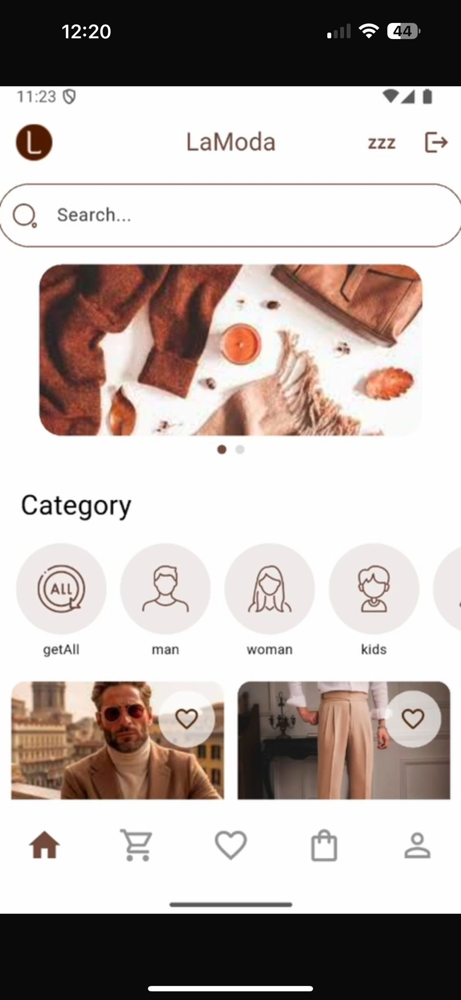
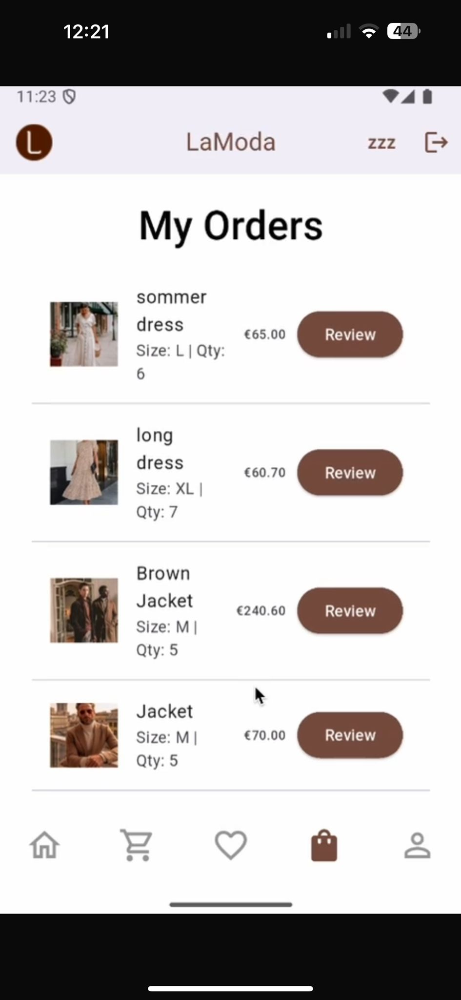
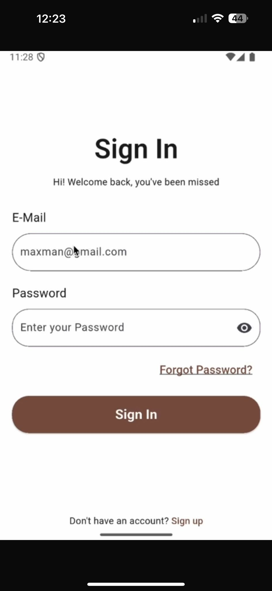
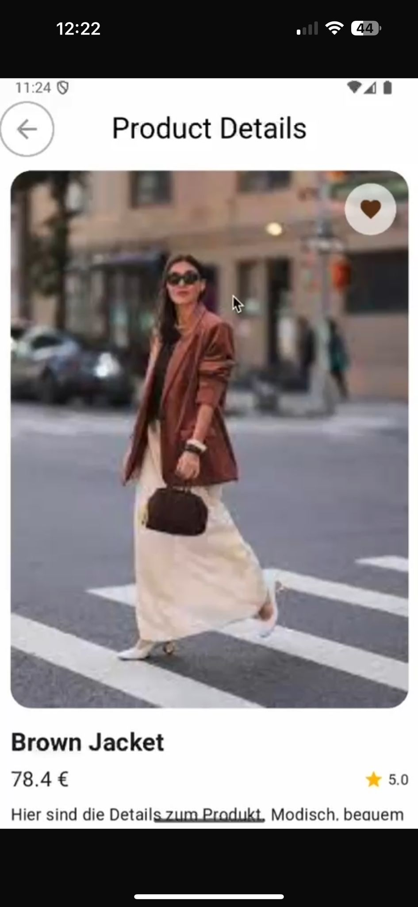

## LaModa – Shopping App (Flutter)

Eine moderne Shopping-App für Kleidung verschiedener Altersgruppen.
Entwickelt mit Flutter und Android Studio.

## 👤 Login Testzugang

Benutzername: test1
Passwort: test123456

Passwort-Vergessen-Funktion ist vollständig implementiert und funktioniert mit einer echten E-Mail-Adresse.

## 👥 Team

Laila Almejbel
Le-Jean-Housene Dabo

## 📸 Screenshots

## Features

🏠 Home Page
👕 Produktdetailseite
❤️ Wunschliste (Wishlist)
🛒 Warenkorb / Cart Page
👤 Profil vervollständigen
🔐 Login
✏️ Registrieren
✉️ Passwort vergessen (mit echter E-Mail-Adresse)
